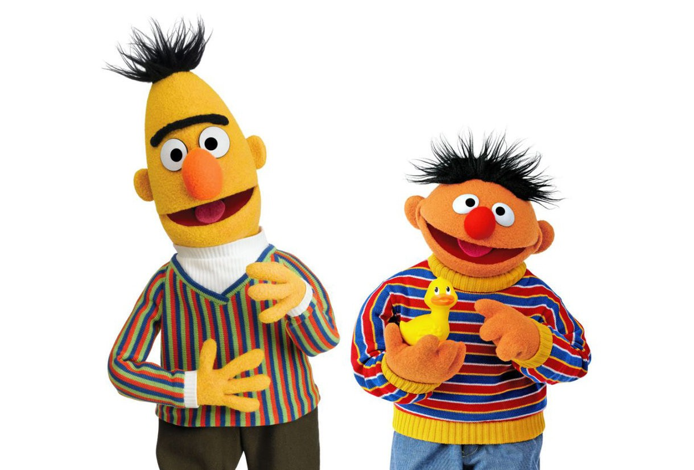

# **🎨 Emotion Draw with ALBERT: The Mighty Mite! 🤖**

## **[BERT:](https://huggingface.co/docs/transformers/en/model_doc/bert) The Big, the Bold, and the Brainy - Why We Gave It a Pass! 🫣**

BERT, short for Bidirectional Encoder Representations from Transformers, is a transformer-based, pre-trained natural language processing (NLP) model introduced by Google in 2018. It was proposed in [BERT: Pre-training of Deep Bidirectional Transformers for Language Understanding](https://arxiv.org/abs/1810.04805) by Jacob Devlin, Ming-Wei Chang, Kenton Lee and Kristina Toutanova. It utilizes a bidirectional Transformer architecture, effectively capturing context from both left and right directions in a given text sequence. It revolutionized natural language processing (NLP) by introducing a pre-trained model on a large corpus comprising the Toronto Book Corpus and Wikipedia, that can be used in Transfer Learning for a wide range of downstream tasks.

### **Overview**

📌 **Architecture**: BERT is based on the transformer architecture, specifically the encoder part.

📌 **Bidirectional Context**: BERT leverages bidirectional context understanding by masking some of the input tokens and predicting them based on the surrounding context.

📌 **Pre-training**: BERT is pre-trained on large corpora of text data using two unsupervised tasks: masked language modeling and next sentence prediction.

**Note:** Refer to [transformers.BertForSequenceClassification](https://huggingface.co/docs/transformers/en/model_doc/bert#transformers.BertForSequenceClassification) for technical documentation.

## **[ALBERT:](https://huggingface.co/docs/transformers/en/model_doc/albert) The Chosen One! 🚀**

ALBERT, short for A Lite BERT, is a variant of the BERT (Bidirectional Encoder Representations from Transformers) model developed by Google AI's researchers, and proposed in [ALBERT: A Lite BERT for Self-supervised Learning of Language Representations](https://arxiv.org/abs/1909.11942) by Zhenzhong Lan, Mingda Chen, Sebastian Goodman, Kevin Gimpel, Piyush Sharma, Radu Soricut. It is designed to address some of the limitations of the original BERT model, such as its large size and computational cost, while maintaining or even improving performance on various natural language processing (NLP) tasks.

### **Overview**

- **Parameter Reduction**: ALBERT introduces several parameter reduction techniques such as splitting the embedding matrix into two smaller matrices and using repeating layers split among groups to reduce the number of model parameters while maintaining performance. 

- **Efficient Pre-training**: ALBERT is pre-trained using unsupervised learning objectives similar to BERT, such as masked language modeling and next sentence prediction.

- **Transformer Architecture**: Like BERT, ALBERT is based on the transformer architecture, which enables it to capture bidirectional context understanding in text data.

### **Pre-training Tasks**

ALBERT is pre-trained using the following unsupervised learning tasks:

1. **Masked Language Modeling (MLM)**: Similar to BERT, ALBERT randomly masks some of the input tokens and predicts them based on the surrounding context. This task encourages the model to learn robust representations of words and phrases.

2. **Sentence Order Prediction (SOP)**: ALBERT also utilizes a sentence order prediction task, where it learns to predict whether two input sentences appear consecutively in the original text or are randomly shuffled. This task helps the model capture relationships between sentences and improve its understanding of document-level context.

### **Advantages for Classification Tasks**

ALBERT offers several advantages for classification tasks:

- **Parameter Efficiency**: ALBERT achieves a significant reduction in the number of model parameters compared to BERT. This reduction in parameters leads to improved parameter efficiency, making ALBERT more suitable for deployment in resource-constrained environments.

- **Faster Training**: Due to its reduced parameter count, ALBERT typically trains faster than BERT, resulting in shorter training times and reduced computational costs.

- **Performance Retention**: Despite its parameter reduction, ALBERT aims to retain or even improve performance compared to BERT on various NLP tasks. This makes it an attractive choice for classification tasks where both performance and efficiency are crucial considerations.

 **Note:** Refer to [transformers.AlbertForSequenceClassification](https://huggingface.co/docs/transformers/v4.40.1/en/model_doc/albert#transformers.AlbertForSequenceClassification) for technical documentation.

### **Experiment Findings: ALBERT's Performance 💡**

| Experiment No. | Model | Checkpoint Saved From | Checkpoint File | Accuracy (%) | F1 Score (%) | Avg Loss | Learning Rate | Batch Size | Training Epochs | Data Portion Used (%) | 
|----------------|-------|-----------------------|-----------------|--------------|----------|------|---------------|-----------|-----------------|-----------------|
| 1 | albert-base-v2 | Epoch 20 | multiclass_experiment1_albert-base-v2_epoch20_checkpoint.pth | 79.80 | 72.44 | 0.74 | 1e-5 | 32 | 20 | 10 |
| 1 | albert-base-v2 | The epoch with the lowest validation loss |multiclass_experiment1_albert-base-v2_best_checkpoint.pth | 79.75 | 71.98 | 0.7 | 1e-5 | 32 | 20 | 10 |
| 2 | albert-base-v2 | Epoch 20 | multiclass_experiment2_albert-base-v2_epoch20_checkpoint.pth | 92.10 | 88.31 | 0.27 | 1e-5 | 32 | 20 | 100 |
| 2 | albert-base-v2 | The epoch with the lowest validation loss | multiclass_experiment2_albert-base-v2_best_checkpoint.pth | 91.95 | 87.63 | 0.17 | 1e-5 | 32 | 20 | 100 |
| 3 | albert-base-v2 | Epoch 20 | multiclass_experiment3_albert-base-v2_epoch20_checkpoint.pth | 92.20 | 88.36 | 0.26 | 2e-5 | 64 | 20 | 100 |
| 3 | albert-base-v2 | The epoch with the lowest validation loss | multiclass_experiment3_albert-base-v2_best_checkpoint.pth | 93.25 | 89.27 | 0.14 | 2e-5 | 64 | 20 | 100 |

## **How Do the Others Perform?**

 If you are interested in the performance of the other BERT-based models on the [Emotions Dataset for NLP](https://www.kaggle.com/datasets/praveengovi/emotions-dataset-for-nlp?resource=download), you can refer to these sources.

 📌 [Benchmarking BERT-based models for text classification.](https://medium.com/@kefactor/benchmarking-bert-based-models-for-text-classification-7182db4df89a)

 📌 [Model Performance Comparision on Emotion Dataset from Twitter](https://huggingface.co/bhadresh-savani/bert-base-uncased-emotion#model-performance-comparision-on-emotion-dataset-from-twitter)