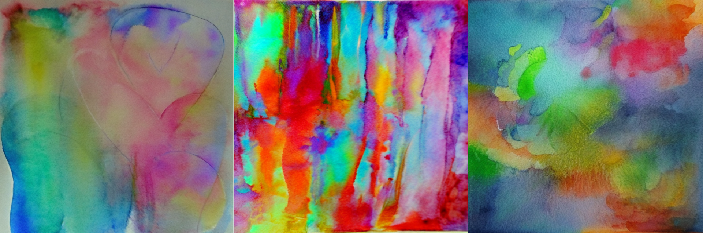

# **The Artist: Stable Diffusion v2-1 👨🏻‍🎨🎨**

## **Introduction to Stable Diffusion Models**

Stable diffusion models represent a significant advancement in the realm of text-to-image generation. These models operate on the principle of [latent diffusion](https://arxiv.org/abs/2112.10752), utilizing a fixed, pretrained text encoder. Among these, the Stable Diffusion v2-1 model stands out for its enhanced capabilities and refinements. Developed by Robin Rombach and Patrick Esser, this model is fine-tuned from its predecessor, [stable-diffusion-2](https://huggingface.co/stabilityai/stable-diffusion-2), with additional training steps and adjustments to parameters, resulting in improved performance and versatility.

## **Overview of [Stable Diffusion v2-1 Model](https://huggingface.co/stabilityai/stable-diffusion-2-1)**

The Stable Diffusion v2-1 model is a diffusion-based text-to-image generation model specifically designed to generate and manipulate images based on textual prompts. Leveraging latent diffusion techniques, this model offers a sophisticated approach to image synthesis.

### **Model Characteristics and Development**

- **Developers**: Robin Rombach and Patrick Esser
- **Model Type**: Diffusion-based text-to-image generation
- **Language(s)**: English
- **License**: [CreativeML Open RAIL++-M License](https://huggingface.co/stabilityai/stable-diffusion-2/blob/main/LICENSE-MODEL)

### **Model Description**

At its core, the Stable Diffusion v2-1 model relies on a [latent diffusion model](https://arxiv.org/abs/2112.10752) combined with a fixed, pretrained text encoder ([OpenCLIP-ViT/H](https://github.com/mlfoundations/open_clip)). This combination allows for the generation of high-quality images from textual descriptions. The model architecture and training methodologies are outlined in detail in the associated GitHub repository.

### **Citation Information**

Researchers and practitioners, including us, utilizing the Stable Diffusion v2-1 model are encouraged to cite the following publication:

```
@InProceedings{Rombach_2022_CVPR,
    author    = {Rombach, Robin and Blattmann, Andreas and Lorenz, Dominik and Esser, Patrick and Ommer, Bj\"orn},
    title     = {High-Resolution Image Synthesis With Latent Diffusion Models},
    booktitle = {Proceedings of the IEEE/CVF Conference on Computer Vision and Pattern Recognition (CVPR)},
    month     = {June},
    year      = {2022},
    pages     = {10684-10695}
}
```

### **Limitations, Bias, and Ethical Considerations**

While the Stable Diffusion v2-1 model offers impressive capabilities, it is essential to acknowledge its limitations, biases, and ethical considerations:

- **Limitations**: The model may not achieve perfect photorealism, struggle with certain tasks like rendering legible text, and exhibit challenges in generating specific compositions or accurately depicting faces and people.

- **Bias**: Models like Stable Diffusion v2-1 may reflect and reinforce biases present in their training data, particularly concerning language and cultural representations. Viewer discretion is advised due to potential biases and limitations.


## **Our Mission: Prompt Engineering 💬**

In utilizing the Stable Diffusion v2-1 model, our approach lies on prompt engineering. We opted not to fine-tune the model, instead focusing on crafting an optimal prompt to achieve our artistic vision. 

Our current prompt is crafted to illustrate the predicted emotions using carefully selected color palettes, watercolor techniques, and smooth color transitions.

In the following script, the `color_emotion` dictionary maps each emotion to a set of corresponding colors. For each emotion in the list of predicted emotion, a prompt is generated that specifies an "ENERGY ART STYLE" representation. The resulting prompts are designed to evoke the intended emotional response through visual art.

```py
prompts = []
    
color_emotion = {
    'anger': "Red, Black, Dark Brown, Orange, Dark Gray",
    'fear': "Black, Dark Purple, Dark Blue, Dark Green, Gray",
    'joy': "Yellow, Orange, Bright Green, Sky Blue, Pink",
    'sadness': "Gray, Dark Blue, Black, Dark Green, Pale Purple",
    'love': "Red, Pink, White, Lavender, Peach",
    'surprise': "Bright Orange, Neon Green, Yellow, Silver, Electric Blue"
}

for emotion in emotions:
    prompts.append(f"ENERGY ART STYLE representation of the feeling of {emotion}. Use colors {color_emotion[emotion]}. Waterpaint. Smooth color transitions.")
```



Users have the freedom to modify the prompt to explore different artistic outcomes, ensuring flexibility and creativity in the generative process. 

Our mission centers on empowering users to shape their creative vision and maximize the model's potential through thoughtful prompt customization.
